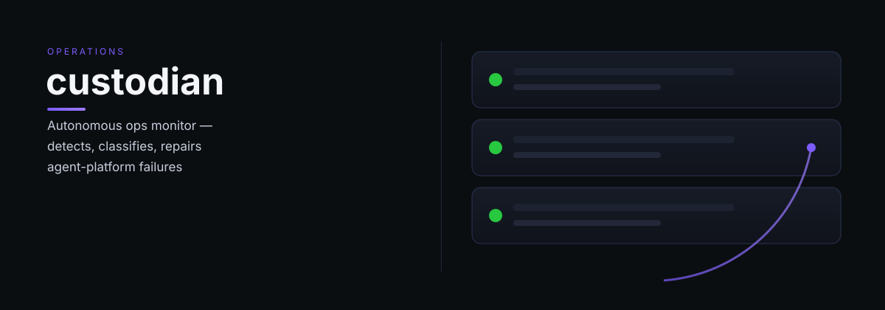

# custodian

custodian — Custodian: autonomous operations monitor — detects, classifies, and repairs agent platform failures during quiet hours.

> One clear job, done well.

---

*custodian is part of the [OCAS Agent Suite](https://github.com/indigokarasu).*